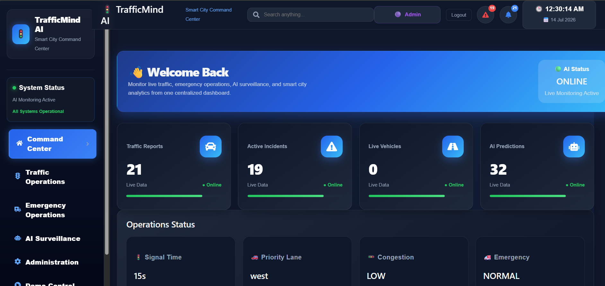
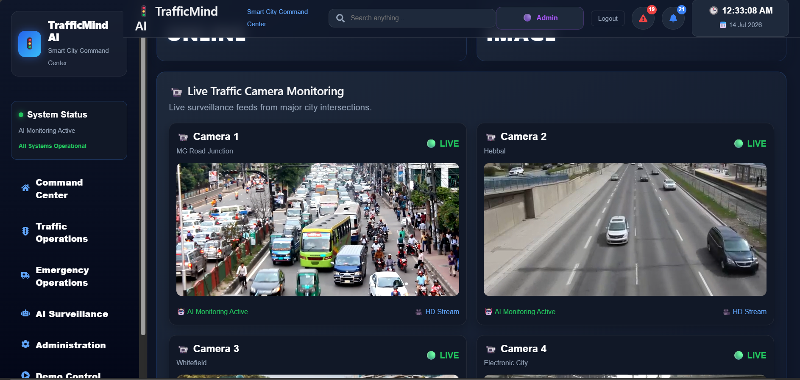
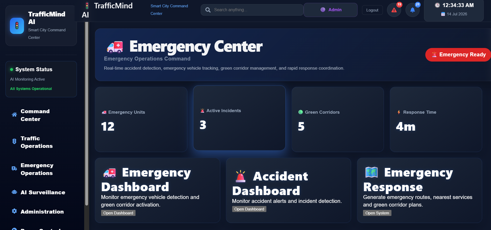

<div align="center">

# 🚦 TrafficMind AI

### AI-Powered Smart Traffic Management System


---

### 🚀 Intelligent Traffic Monitoring • AI Accident Detection • Emergency Response • Smart Analytics

</div>

---

# 📖 Overview

TrafficMind AI is an AI-powered Smart Traffic Management System designed to improve urban traffic operations using Artificial Intelligence, Computer Vision, Machine Learning, and Real-Time Analytics.

The system helps monitor traffic conditions, detect accidents automatically, generate emergency routes, analyze congestion, and provide intelligent insights for traffic authorities.

---

# ✨ Features

- 🤖 AI Vehicle Detection (YOLOv8)
- 🚨 AI Accident Detection
- 🚦 Smart Traffic Monitoring
- 🚑 Emergency Route Management
- 📊 Traffic Analytics Dashboard
- 🌦 Weather Integration
- 📍 Live Traffic Intelligence
- 👤 Role-Based Authentication
- 📄 AI Analysis Reports
- 📹 Image & Video Analysis
- 🔥 Incident Management
- 📈 Traffic Prediction
- 🛡 Government Administration Panel

---

# 🛠 Technology Stack

## Frontend

- React.js
- Vite
- React Router
- CSS3
- Axios

## Backend

- Node.js
- Express.js
- MongoDB
- Socket.io

## Artificial Intelligence

- Python
- YOLOv8
- OpenCV
- Machine Learning

---

# 🏗 System Architecture

```text
             User
               │
               ▼
     React Frontend (Vite)
               │
        REST APIs
               │
               ▼
      Node.js + Express
               │
       ┌───────────────┐
       │               │
       ▼               ▼
 MongoDB         Python AI Engine
                     │
              YOLOv8 + OpenCV
                     │
             AI Predictions
```

---

# 📂 Project Structure

```text
TrafficMind-AI
│
├── backend/
│   ├── routes/
│   ├── models/
│   ├── ai/
│   ├── ml/
│   └── server.js
│
├── frontend/
│   ├── src/
│   ├── public/
│   └── components/
│
└── README.md
```

---

# 🚀 Installation

### Clone Repository

```bash
git clone https://github.com/Shreeshantpammar05/TrafficMind-AI.git
```

### Backend

```bash
cd backend
npm install
npm start
```

### Frontend

```bash
cd frontend
npm install
npm run dev
```

---

# 📸 Screenshots

## 🔐 Login Page


---

## 🏠 Command Center



---

## 🤖 AI Vision Center



---

## 🚑 Emergency Center



---

# 🎥 Demo

> Demo video coming soon.

---

# 🔮 Future Enhancements

- Live CCTV Camera Integration
- AI Traffic Signal Optimization
- Digital Twin City Monitoring
- AI Chat Assistant
- Mobile Application
- Predictive Traffic Forecasting
- Drone Surveillance Integration

---

# 👨‍💻 Developer

**Shreeshant Pammar**

GitHub:

https://github.com/Shreeshantpammar05

---

# ⭐ Support

If you like this project, consider giving it a ⭐ on GitHub!

---

<div align="center">

### 🚦 Building Smarter Roads with Artificial Intelligence 🚦

</div>